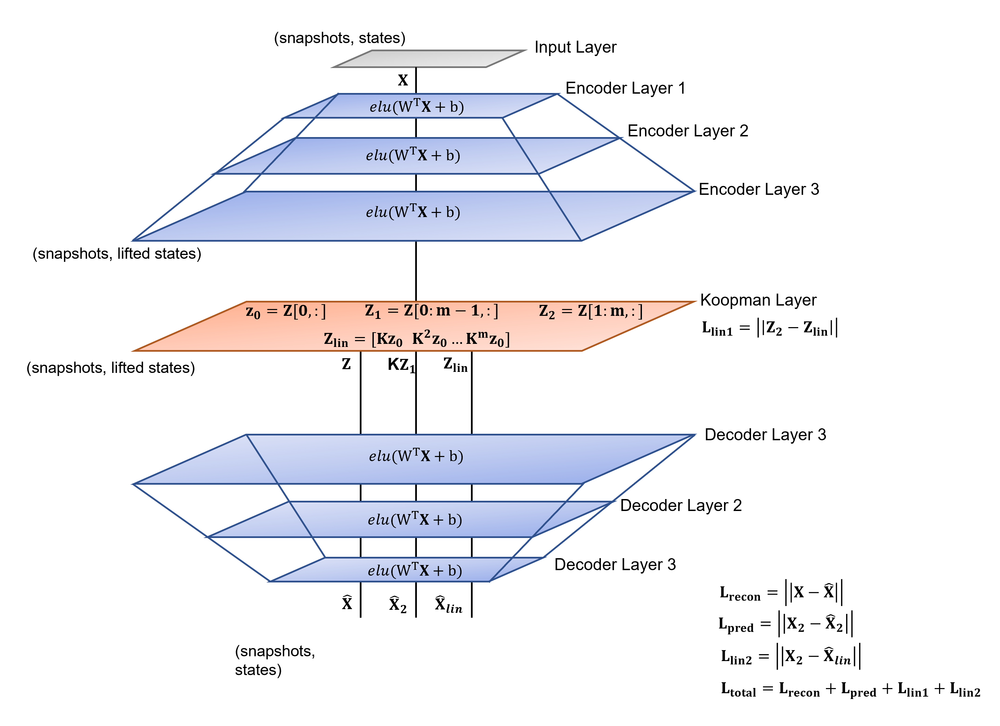

# Deep Koopman AutoEncoder
DNN based Koopman autoencoder model

Future work will extend this architecture to approximate the principle eigenfunction coordinate transformation as the encoder network.

Knowledge of the local linear eigenvalues can be exploited and impose a soft constraint on the learned basis function. 
Its easy to see how this framework makes it possible to impose combinations of constraints through the loss function. 

The tanh activation function is an example of an analytical function which satisfies the necessary gradient constraints at the origin.

